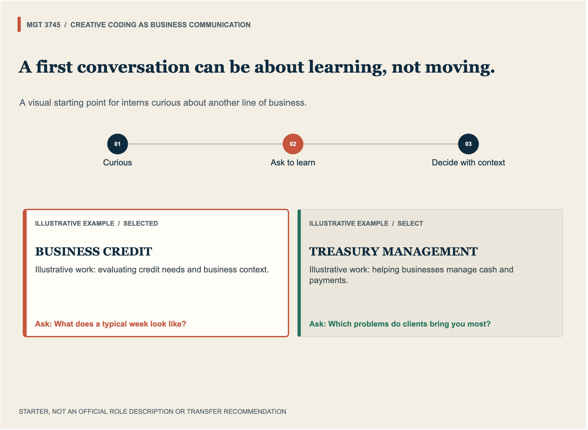

# HW5 Optional Bonus: 5B Light

## Decision

This project addresses the hesitation interns can feel when they want to learn about another team without signaling dissatisfaction or a transfer request. The sketch makes an information-first conversation path visible, using the two illustrative F-04 areas from HW5: Business Credit and Treasury Management. The full decision and medium trade-off are in [docs/BRIEF.md](docs/BRIEF.md).

## See It Work

- p5.js sketch: https://editor.p5js.org/mehtaaashi05/full/EissLUnr5
- Screenshot of the running sketch:

- The sketch is a prototype only. Its examples are illustrative, not official role descriptions or transfer recommendations.

## Judgment

Show the sketch to a second viewer without explaining it, record their one-sentence answer, and mark whether it matched the brief in [docs/JUDGMENT.md](docs/JUDGMENT.md). Do not fill in a response that was not actually collected.
